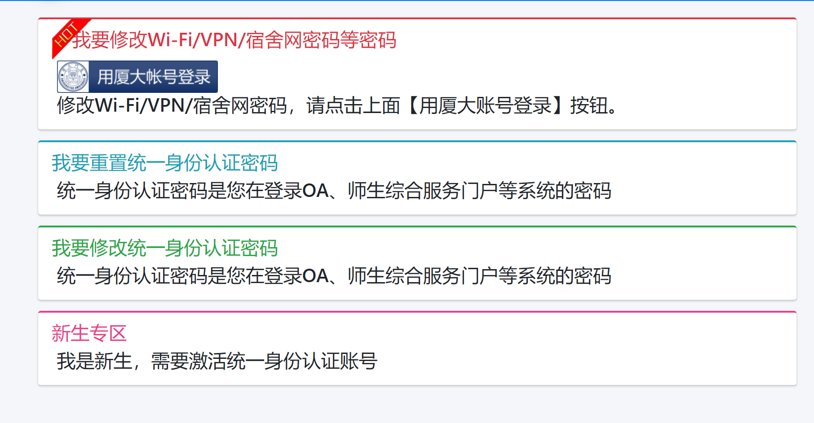
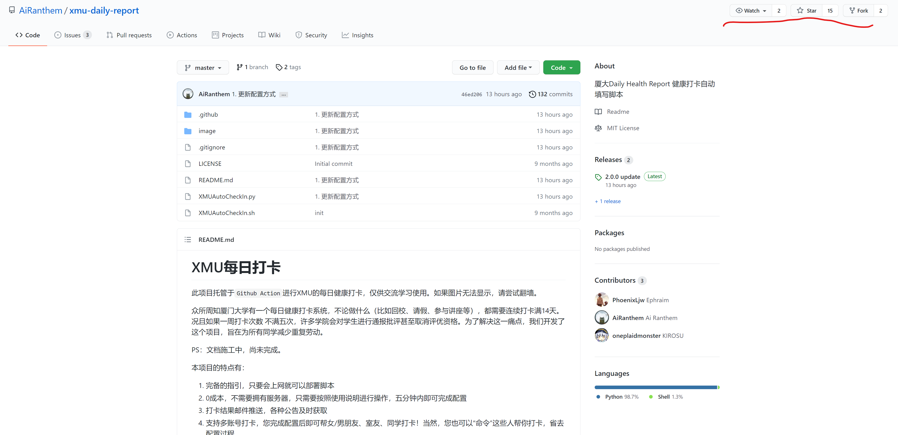
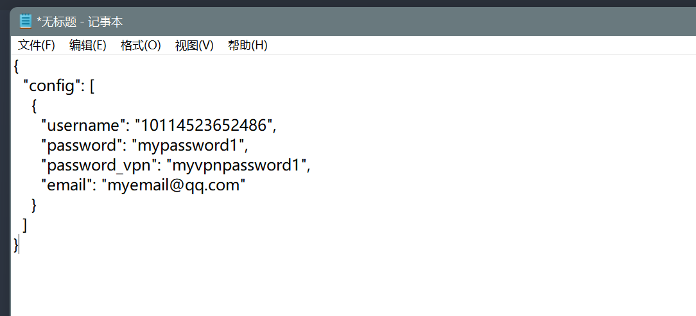
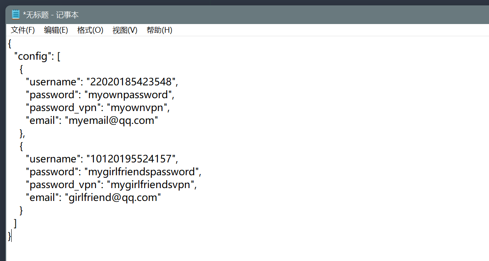
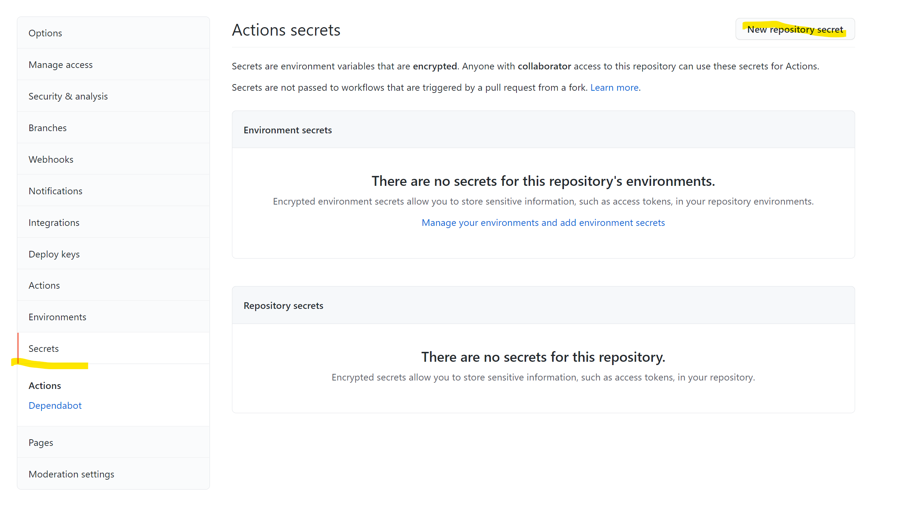
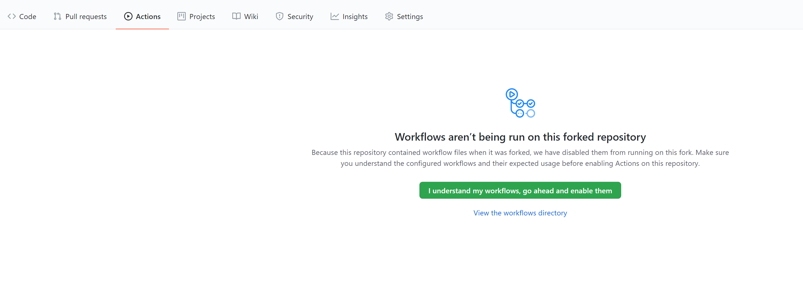
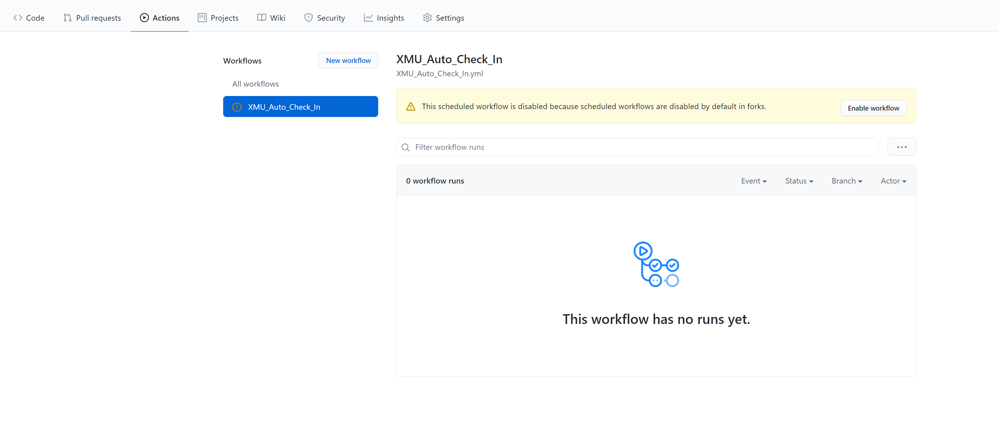
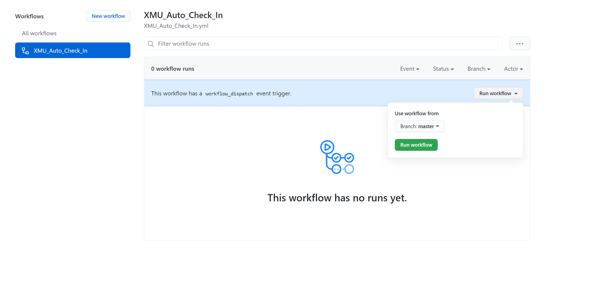
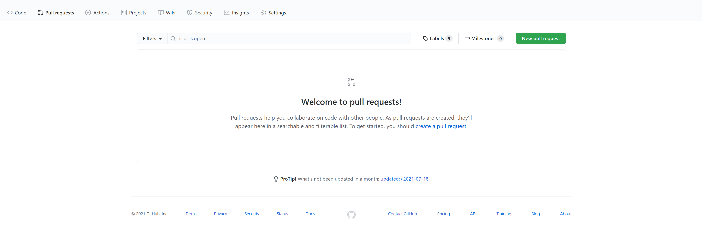

# XMU每日打卡

此项目托管于``Github Action``进行XMU的每日健康打卡，仅供交流学习使用。如果图片无法显示，请尝试翻墙。

本项目的特点有：

1. 完备的指引，只要会上网就可以部署脚本
2. 0成本，不需要拥有服务器，只需要按照使用说明进行操作，五分钟内即可完成配置
3. 打卡结果邮件推送，各种公告及时获取
4. 支持多账号打卡，您完成配置后即可帮女/男朋友、室友、同学打卡！当然，您也可以“命令”这些人帮你打卡，省去配置过程。
5. 完全免费开源，欢迎同学们贡献自己的代码

如果您喜欢这个项目，请给一个小小的Star

## 免责声明

本项目的开发者完全出于以下目的而进行开发：

1. 练习 selenium、fastapi 等 python 全栈与爬虫技术
2. 学习完整的开源项目流程，包括开发、测试、维护等
3. 掌握 GitHub 的相关进阶操作

本项目承诺：

1. 该项目的所有代码、文档、示例等均是以学习全过程软件开发与学习交流为目的，所有开发者除了必要的功能测试以外，没有在任何时间下使用过这个项目。
2. 该项目父仓库的所有 Actions 均采用了测试用配置，仅仅用于监控软件状态以确认维护工作的任务，没有真正用于打卡。
3. 本项目不会保存您的所有个人信息，不必担心隐私泄露。

如果您尝试配置了本项目，请于24小时内删除，支持手动打卡工作。

本项目遵守 [MIT License](LICENSE) ,任何个人或组织拥有任意使用、复制、修改、合并、出版发行、散布、再许可和/或贩售软件及软件的副本，及授予被供应人同等权利的权利。因为第三方个人或组织使用该软件而产生的任何不良后果，本项目的 所有开发者不承担任何责任。

## 本文档编写目的

软件的文档相当于说明书，对于文档的要求即是：让基础最差的用户都能轻易看懂而上手软件。

该文档的编写完全出于练习文档写作，并不鼓励用户使用本项目。 该文档的目标受众以计算机基础能力作为差分，最低为语言类文科本科新生，最高为计算机类博士四年级生。 文档对于差分值高的用户可能过于繁琐，请谅解。

如果对文档写作有任何意见与建议，请与作者联系。

## 更新日志

+ 2021/8/18 简化配置过程，支持多账号打卡。

## 自动化打卡条件

请仔细阅读本章节，保证自己已经满足所有自动化打卡条件。如果不满足任意一条条件，请在本章节的指导下完成相关工作，否则将无法使用该项目进行打卡。

不仅仅用于自动打卡，本章节要求您做的所有操作都是您在厦大生活必须所必须的账号，包括身份认证系统、校园网系统等。与其等到急需使用这些系统的时候手忙脚乱，不如花上五分钟 阅读完本章节，一劳永逸。

### 1. 能够使用统一身份认证登录

确认方式：访问[https://xmuxg.xmu.edu.cn/login](https://xmuxg.xmu.edu.cn/login) ，点击右侧第三个按钮“统一身份认证”，成功登录 （如果原先已登陆请点击右上角进行注销）

解决方案：如果您从未使用统一身份认证登录，请访问[https://pass.xmu.edu.cn](https://pass.xmu.edu.cn) ，点击“新生专区” 进行激活。如果您忘记了密码，则点击“我要修改统一身份认证密码”

### 2. 设置了厦大VPN密码

请保证您记得厦大VPN的密码。原则上这个密码和您登录校园网 XMUNET+ 的密码是同一个。

因为厦大的各种系统稳定性极差，隔三岔五就会进行长达数周的维护，同时所有系统禁止校外访问。在此期间，打卡脚本需要使用厦大VPN进行工作。

如果您忘记了密码，请访问 [https://pass.xmu.edu.cn](https://pass.xmu.edu.cn) ，点击“我要修改Wi-Fi/VPN/宿舍网密码等密码”框内的
“用厦大账号登录”，使用上一步设置的统一身份认证进行登录，之后点击“修改Wi-Fi/VPN/宿舍网密码”进行修改。

### 3. 手动完成过至少一次健康打卡

该项目会自动提交与上一次打卡结果相同的表单，如果从来没有进行过打卡那么将会发生错误。第一次进行打卡的很多信息同样也需要您进行提供，所以请
登录 [https://xmuxg.xmu.edu.cn/app/214](https://xmuxg.xmu.edu.cn/app/214) ，点击“我的表单”完成一次打卡。

### 4. 注册一个Github账号

GitHub是世界上最大的开源软件社区，也就是您正在浏览的这个页面。即使您是文科生，专业与计算机完全无关，我也推荐您拥有一个Github账号。
Github上有您日后需要的所有复习资料、电子书、工具与数据集等资源，一定会对您的科研与学习大有裨益。点击页面右上角的“Sign Up”即可注册账号。

## 配置说明

在进行配置之前，请确认您已经满足了上一章所提到的所有条件。如果配置过程中有任何不明确的，请与项目维护者 [AiRanthem](https://github.com/AiRanthem) 联系。

整个配置过程大概需要花费5~10分钟。

### 1. 登录Github账号并fork代码仓库

看见页面右上角的三个按钮了吗？依次点击 `Star` 和 `Fork`。

稍等片刻之后，等页面刷新完成，您会发现左上角的用户名已经变成了您自己的。此刻您已经拥有了一份该项目的副本。

### 2. 编辑配置文件

这是全程最困难的一步，大概需要花费2分钟。这可能是您第一次编辑所谓配置文件，大可不必惊慌，只需要简单地像填写表格一样填写信息即可。 
配置文件的编辑本质上与您填写过的志愿表、奖学金申请书等完全一样，在给定的空间内填入正确的信息即可。请耐心尝试。

请点击下面的链接，获取配置文件模板，将其复制到您常用文本编辑器中（不推荐使用word），按照模板的提示修改内容。

邮箱地址是用来接收打卡结果的，推荐与Github的注册邮箱保持一致，这样如果运行失败，可以接收到错误信息以根据[疑难解答](#疑难解答)章节解决问题。

**请注意：您只需要修改冒号右侧的部分，并且请不要删除引号**

如果您不知道什么是文本编辑器，请按快捷键`Win+R`，输入 `notepad`。 记事本是Windows系统下最常用的文本编辑器。

| 人数 | 链接
|:---:|:---:
|1|[单人链接](template/config1.json)
|2|[双人链接](template/config2.json)
|3|[三人链接](template/config3.json)
|4|[四人链接](template/config4.json)

如果您懂什么是`json`字符串，或者善于寻找规律，应该能自己推理出更多人的链接配置如何写。

下图是一个单人链接的示例：

下图是一个双人链接的示例：

### 3. 配置Secrets

请点击该页面上方导航栏最右侧的的`settings`。如果没有这个按钮，请确认是否在您自己的仓库内（左上角的名字是您自己的用户名）。如果不在，请参考 [关闭页面后我如何再一次进入我的仓库副本](#关闭页面后我如何再一次进入我的仓库副本)

点击左侧的 `Secrets` ，在新的页面中点击右上角的 `New repository secret`

在`Name`中输入`CONFIG`（**注意：Name的CONFIG一定要大写**），在`Value`中粘贴刚才您编辑的文本，然后点击`Add secret`按钮

`Repository Secret` 是Github提供的一种仓库属性，属于“三不知”数据，即开发者不知道、GitHub工作人员不知道且你也不知道。添加Secret后，对应的Value将会被隐藏，没有任何办法看到它，将会保证绝对的安全。

### 4. 启用任务并测试

点击导航栏的`Actions`，点击绿色的按钮`I understand ....`

然后点击左侧Workflows中的`XMU_Auto_Check_in`，点击右侧`Enable workflow`

最后点击 `Run workflow`，在下拉菜单中点击绿色的按钮 `Run workflow`

等待收到邮件即可。推荐手机安装邮箱APP，收到邮件时将会推送消息。如果收到成功邮件，则配置完毕。否则，请参考[打卡失败怎么办](#打卡失败怎么办)

## 仓库维护

### 更新
根据[关闭页面后我如何再一次进入我的仓库副本](#关闭页面后我如何再一次进入我的仓库副本) 进入仓库副本中，点击导航栏的`Pull requests`，再点击绿色的`New pull request`按钮

按照下面的动图进行操作。唯一的注意点就是请让pull request左侧的是您的仓库副本，右侧是 `AiRanthem` 的原始仓库。

Pull Request操作其实就是在仓库间进行同步，将右侧仓库的内容推送到左侧仓库中。理解了这一点就能记住箭头两侧如何选择。如果仓库名消失，请按照动图中演示的点击上方蓝色的`compare across forks`即可重新显示。

## 疑难解答

### 关闭页面后我如何再一次进入我的仓库副本

请访问 [github.com](https://github.com)，在左侧可以找到您的副本 `您的用户名/xmu-daily-report`，点击即可进入。

### 打卡失败怎么办

收到Github官方发送的邮件 `xxx run failed`

> 请确认您的配置文件是否正确。可能是缺少了引号或格式错误。请尝试重新编辑配置文件后进入 Settings/Secrets 页面，对`CONFIG`进行`Update`

收到`XMU每日打卡`发送的打卡失败邮件

> 可能因为意外发生了错误，请今天暂时手动打卡。如果连续多天发生打卡失败，可能仓库需要更新，请参考章节[更新](#更新)

## 如何与维护者联系

如果有疑问需要联系作者，可以直接向`XMU每日打卡`回复邮件，或在[原项目](https://github.com/AiRanthem/xmu-daily-report) 提issue

## 贡献者

+ [PhoenixLjw](https://github.com/PhoenixLjw) 初版代码
+ [AiRanthem](https://github.com/AiRanthem) 项目维护

PhoenixLjw 同学已经毕业，不再参与项目。如有建议，欢迎与 AiRanthem 联系。
